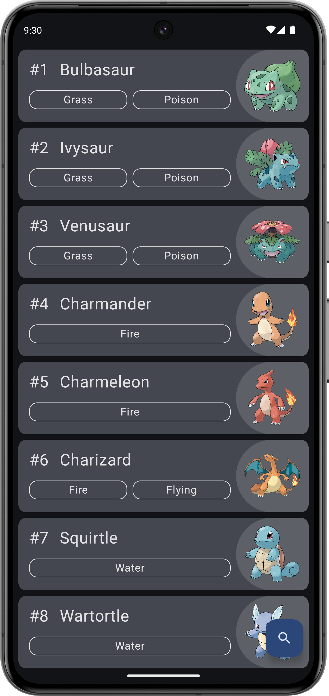

This is a Pokédex app that I am still working on implementing all the features.

Current features:
- View list of pokémon
- View pokémon abilities, base stats, and evolution line
- Search for pokémon by name
- Filter pokémon by types
- Filter screen with more types of filters
- Dark/light mode

 

 

 

 

 

